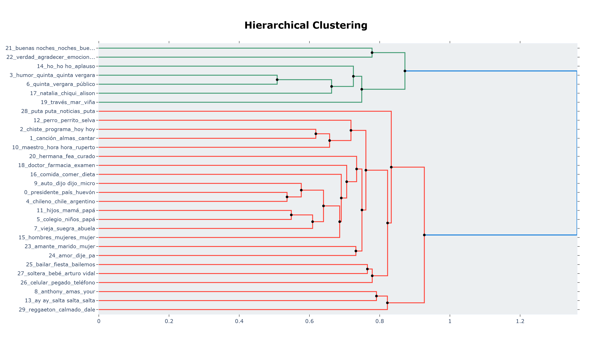
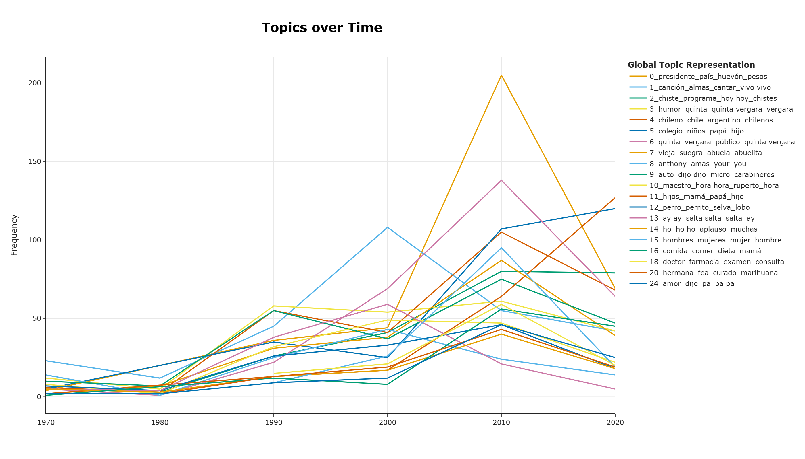
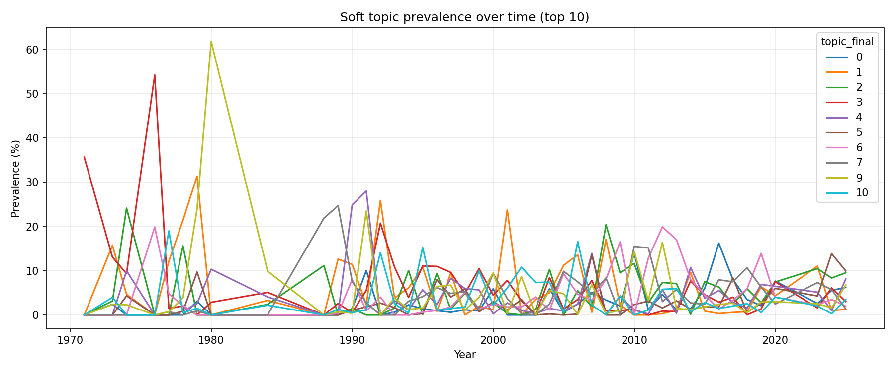
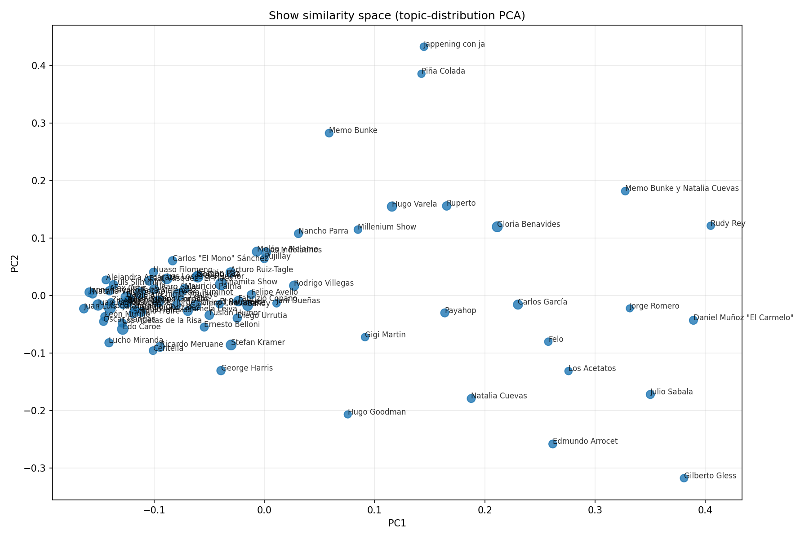

# Chilean Humor Topic Modeling and Advanced Analysis Audit Report

Date: 2026-02-13  
Project: `chilean-humor`

## 1. Purpose and Audit Scope

This report documents the end-to-end analytical flow used to build topic-based insights from Chilean comedy transcript segments and to run the advanced downstream analyses.

The goal is auditability: a future reader should be able to inspect assumptions, reproduce outputs, and propose methodological improvements.

This report covers:

- Data loading and preprocessing filters.
- Topic detection with BERTopic.
- Hierarchical topic inspection and manual curation decisions.
- Advanced analysis outputs (topic lifecycle, soft prevalence over time, show similarity, PCA).
- Reproducibility and limitations.

## 2. Main Artifacts Used

Core scripts:

- `scripts/run_topic_modeling.py`
- `src/chilean_humor_topic_modeling/preprocessing.py`
- `src/chilean_humor_topic_modeling/modeling.py`
- `src/chilean_humor_topic_modeling/pipeline.py`
- `scripts/advanced_topic_analysis.py`

Core outputs:

- `outputs/topic_modeling/run_report.json`
- `outputs/topic_modeling/tables/segments_topics.csv`
- `outputs/topic_modeling/tables/hierarchical_topics.csv`
- `outputs/topic_modeling/figures/topic_hierarchy.png`
- `outputs/topic_modeling/figures/topics_over_time_top_n.png`
- `outputs/advanced_analysis/analysis_summary.json`
- `outputs/advanced_analysis/tables/topic_lifecycle_metrics.csv`
- `outputs/advanced_analysis/tables/show_similarity_pairs_topk.csv`
- `outputs/advanced_analysis/figures/soft_topic_prevalence_top_topics.png`
- `outputs/advanced_analysis/figures/show_topic_space_pca.png`

## 3. Pipeline Overview

End-to-end flow:

1. Load transcript segments from Hugging Face dataset (`astroza/chilean-humor-raw-transcripts`, config `segments`, split `train`).
2. Filter low-quality segments (empty, too short, numeric noise, invalid date).
3. Compute text embeddings (Jina v4 API in this run, cached on disk).
4. Train BERTopic with deterministic UMAP/HDBSCAN and Spanish-oriented c-TF-IDF vectorization.
5. Reassign outliers (`reduce_outliers`) and export topic artifacts.
6. Inspect hierarchical topic structure and identify non-content (meta-stage) topics.
7. Run advanced analysis with curated exclusions.

## 4. Data and Preprocessing

Source stats from `outputs/topic_modeling/run_report.json`:

| Metric | Value |
|---|---:|
| Total raw rows | 4,645 |
| Kept for modeling | 4,568 |
| Skipped: too short | 49 |
| Skipped: numeric noise | 28 |
| Skipped: invalid date | 0 |

Modeling time coverage after filtering: **1971 to 2025**.

Segment cleaning logic (`src/chilean_humor_topic_modeling/preprocessing.py`):

```python
if len(text) < config.min_text_chars:
    skipped_too_short += 1
    continue
if len(text.split()) < config.min_text_tokens:
    skipped_too_short += 1
    continue
if is_numeric_noise(text):
    skipped_numeric_noise += 1
    continue

decade = parse_decade(raw_date)
if decade is None:
    skipped_invalid_date += 1
    continue
```

Interpretation:

- This removes low-information segments before topic learning.
- The date parser enforces temporal consistency needed for topic-over-time analyses.

## 5. Topic Detection Method

### 5.1 Embeddings and caching

Run configuration indicates:

- `use_jina_embeddings = true`
- `jina_provider = api`
- `jina_model_name = jina-embeddings-v4`
- `jina_task = text-matching`
- `jina_truncate_dim = 128`
- `jina_batch_size = 16`

Embeddings are cached under `outputs/topic_modeling/embeddings_cache/` using a content + config hash key.

### 5.2 BERTopic configuration

Key settings from `run_report.json`:

| Component | Setting |
|---|---|
| Seed | 42 |
| UMAP | n_neighbors=15, n_components=10, min_dist=0.0, metric=cosine |
| HDBSCAN | min_cluster_size=22, min_samples=6, metric=euclidean, method=eom |
| Vectorizer | ngram_range=(1,2), min_df=2, Spanish stopwords + custom list |
| c-TF-IDF | BM25 weighting + reduce frequent words |
| Outlier reassignment | enabled (`strategy=distributions`, `threshold=0.0`) |

Model construction (`src/chilean_humor_topic_modeling/modeling.py`):

```python
return BERTopic(
    language=config.language,
    embedding_model=effective_embedding_model,
    vectorizer_model=build_vectorizer(config),
    ctfidf_model=ctfidf_model,
    umap_model=build_umap_model(config),
    hdbscan_model=build_hdbscan_model(config),
    calculate_probabilities=config.calculate_probabilities,
    verbose=config.verbose,
)
```

### 5.3 Outlier behavior

From `run_report.json` diagnostics:

- Initial outlier rate: **56.90%**.
- Final outlier rate after reassignment: **0.0219%** (1 segment).
- Final non-outlier topics: **30**.

Interpretation:

- The pipeline strongly relies on post-fit outlier reassignment to reduce the large default `-1` pool.
- This is useful for coverage, but can also introduce assignment uncertainty for borderline segments.

## 6. Hierarchical Topic Review and Manual Curation

Hierarchy inspection (`outputs/topic_modeling/tables/hierarchical_topics.csv`) highlighted parent cluster `56`:

- `Parent_Name`: `quinta_vergara_quinta vergara_humor_escenario`
- `Topics`: `[3, 6, 14, 17, 19, 21, 22]`

This cluster grouped many stage/hosting/applause signals. A stricter semantic decision was made to remove only topics explicitly labeled as `Meta-humor de escenario`:

- Excluded topics: **3, 6, 17, 22**
- Excluded segments: **693**

Per-topic impact:

| Topic ID | Segments |
|---:|---:|
| 3 | 232 |
| 6 | 299 |
| 17 | 79 |
| 22 | 83 |
| **Total** | **693** |

Implementation in `scripts/advanced_topic_analysis.py`:

```python
if self.cfg.excluded_topics:
    before = len(df)
    df = df[~df['topic_final'].isin(self.cfg.excluded_topics)].copy()
    self.n_excluded_topics_segments = before - len(df)
```

The script now defaults to:

```python
default='3,6,17,22'
```

Resulting advanced-analysis sample size:

- Assigned topic segments before exclusions: `4567`
- Excluded by curated filter: `693`
- Segments analyzed: `3874`
- Topics detected in advanced outputs: `26`

## 7. Advanced Analysis Methodology

Advanced analysis (`scripts/advanced_topic_analysis.py`) uses the filtered segment-topic table (`topic_final != -1` and excluding curated topic IDs).

Main computations:

1. `soft_topic_prevalence_by_year.csv`:
   - Weighted topic mass per year.
   - Weight = `max_topic_probability` (fallback to 1.0).
   - Prevalence formula: `100 * topic_mass / year_mass`.
2. `topic_lifecycle_metrics.csv`:
   - Birth year where prevalence >= `1.0%`.
   - Active years, volatility (`mean absolute diff`), mean and max prevalence.
3. Show similarity (`show_similarity_matrix.csv`, `show_similarity_pairs.csv`):
   - Build per-show topic distributions.
   - Keep shows with at least 15 segments.
   - Similarity metric: cosine similarity.
4. PCA map (`show_topic_space_pca.csv` + figure):
   - 2D embedding of show-topic distributions for visual inspection.

Filtering effect on show eligibility:

| Metric | Value |
|---|---:|
| Shows after topic exclusions | 90 |
| Shows with >= 15 segments (used in similarity) | 76 |
| Shows below threshold | 14 |

## 8. Key Results Snapshot

### 8.1 Topic lifecycle (top topics by mean prevalence)

From `outputs/advanced_analysis/tables/topic_lifecycle_metrics.csv`:

| Topic ID | Mean Prevalence % | Birth Year | Active Years |
|---:|---:|---:|---:|
| 8 | 10.88 | 1971 | 24 |
| 12 | 9.70 | 1973 | 26 |
| 1 | 9.38 | 1973 | 30 |
| 7 | 7.55 | 1977 | 32 |
| 2 | 7.53 | 1973 | 32 |
| 9 | 6.96 | 1973 | 34 |
| 13 | 6.59 | 1973 | 25 |
| 4 | 5.86 | 1974 | 32 |

### 8.2 Show similarity (top pairs)

From `outputs/advanced_analysis/tables/show_similarity_pairs_topk.csv`:

| Rank | Show A | Show B | Cosine Similarity |
|---:|---|---|---:|
| 1 | Millenium Show | Ruperto | 0.8770 |
| 2 | Memo Bunke | Piña Colada | 0.8634 |
| 3 | Edmundo Arrocet | Gilberto Gless | 0.8632 |
| 4 | Memo Bunke y Natalia Cuevas | Rudy Rey | 0.8579 |
| 5 | Edmundo Arrocet | Natalia Cuevas | 0.8552 |

## 9. Figures for Audit

### 9.1 Topic hierarchy (BERTopic)



### 9.2 Topics over time (top N)



### 9.3 Soft topic prevalence over time (advanced analysis)



### 9.4 Show-topic similarity space (PCA)



## 10. Assumptions and Design Choices

- Segments are treated as independent units; discourse context between neighboring segments is not modeled.
- Decade/year comes from string date parsing; malformed dates are dropped.
- Topic soft weights use `max_topic_probability` as a confidence proxy.
- Outlier reassignment is intentionally enabled to maximize topic coverage.
- Manual curation removed stage-meta topics to improve topical relevance for thematic analysis.
- Influence/causal claims are intentionally excluded in advanced outputs.

## 11. Known Limitations

- Topic IDs are model-specific and may drift if BERTopic is retrained with different parameters or data.
- Heavy outlier reassignment can blur borderline distinctions between nearby topics.
- Similarity uses only topic-distribution cosine distance and ignores sequence/order of segments.
- `topic_cluster_labels.csv` is a curated semantic layer and should be versioned as annotation, not treated as model output.

## 12. Suggested Improvements for Future Iterations

1. Add stability checks across multiple seeds and compare topic alignment scores.
2. Track topic quality metrics (coherence/diversity) before and after manual exclusions.
3. Version manual curation decisions in a dedicated YAML/JSON policy file with rationale.
4. Add confidence intervals or bootstrap uncertainty for show similarity rankings.
5. Split analyses by historical eras to reduce imbalance from the 2020s segment concentration.
6. Add a lightweight regression test that asserts expected row counts for every output artifact.

## 13. Reproducibility Commands

Topic modeling:

```powershell
.venv\Scripts\python.exe scripts/run_topic_modeling.py
```

Advanced analysis with current curated default exclusions (`3,6,17,22`):

```powershell
.venv\Scripts\python.exe scripts/advanced_topic_analysis.py
```

Advanced analysis with explicit exclusions:

```powershell
.venv\Scripts\python.exe scripts/advanced_topic_analysis.py --exclude-topics 3,6,17,22
```

## 14. Audit Checklist

- Confirm `outputs/topic_modeling/run_report.json` exists and has no warnings.
- Confirm curated exclusions in `outputs/advanced_analysis/analysis_summary.json`.
- Confirm figures render correctly from the paths in this report.
- Confirm row counts in key tables remain consistent with summary metadata.

